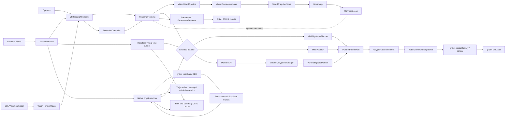
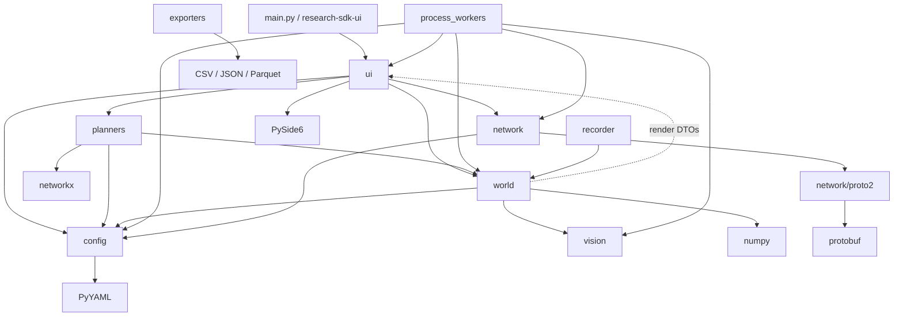
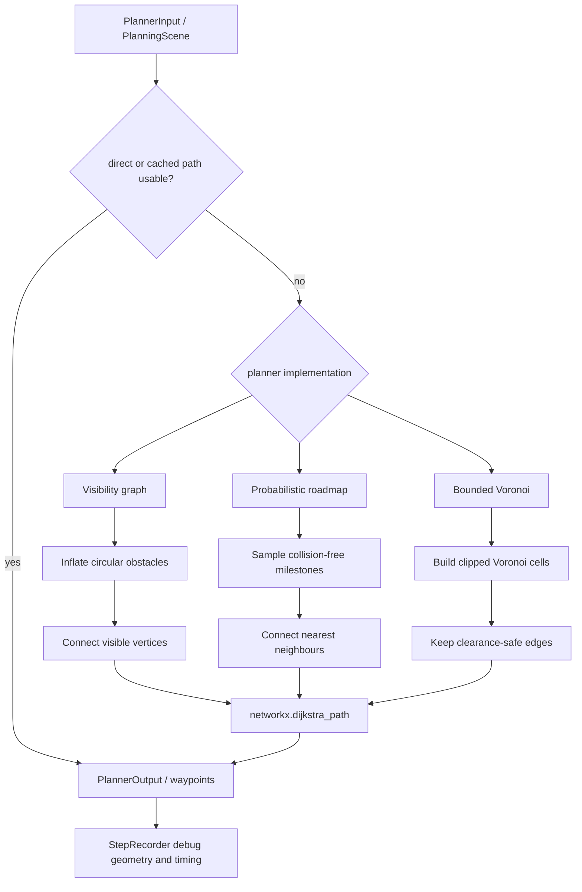
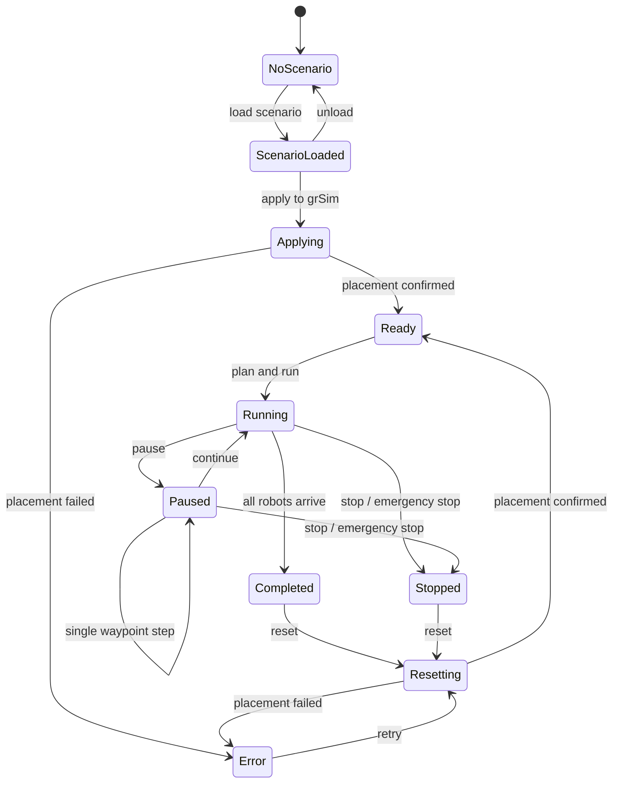

# research-sdk graphify

This is a visual map of the implementation on `main`. It is based on the
runtime entry points and internal imports, rather than the target architecture
described in [`docs/architecture.md`](docs/architecture.md).

## System flow

Solid arrows show the primary control or data path. The dotted edge is used
only when motion prediction is enabled and a live scene is available; otherwise
planning uses obstacles from the selected scenario.

## Package dependencies

The dotted `world -> ui` edge is a real implementation dependency:
`world/map/voronoi/voronoi_generator.py` imports render data classes from
`ui/renderer.py`. `process_workers/voronoi_map_runner.py` does the same. It is
worth keeping in mind if the renderer or the world map is extracted later.

Generated protobuf modules are treated as one node so they do not overwhelm
the graph.

## Planner family

All three planner families share NetworkX Dijkstra search. Their meaningful
difference is how they construct the graph searched by Dijkstra.

## Execution lifecycle

## Where to start reading

| Concern | Primary file |
|---|---|
| Application composition | [`src/research_sdk/ui/app.py`](src/research_sdk/ui/app.py) |
| Runtime planning and command loop | [`src/research_sdk/ui/runtime.py`](src/research_sdk/ui/runtime.py) |
| Scenario and planner session logic | [`src/research_sdk/ui/session.py`](src/research_sdk/ui/session.py) |
| Execution state machine | [`src/research_sdk/ui/execution/controller.py`](src/research_sdk/ui/execution/controller.py) |
| Vision-to-world pipeline | [`src/research_sdk/world/pipeline.py`](src/research_sdk/world/pipeline.py) |
| Dynamic world map | [`src/research_sdk/world/map/world_map.py`](src/research_sdk/world/map/world_map.py) |
| Planner facade | [`src/research_sdk/planners/api.py`](src/research_sdk/planners/api.py) |
| Planner implementations | [`src/research_sdk/planners/`](src/research_sdk/planners/) |
| Network boundaries | [`src/research_sdk/network/`](src/research_sdk/network/) |
| Current implementation notes | [`docs/current.md`](docs/current.md) |
